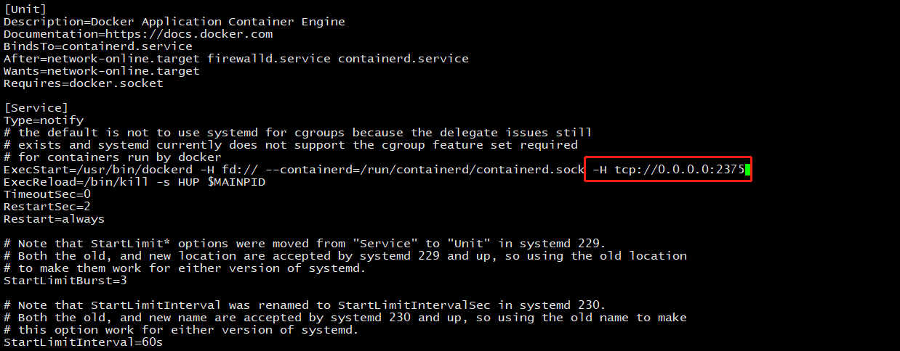
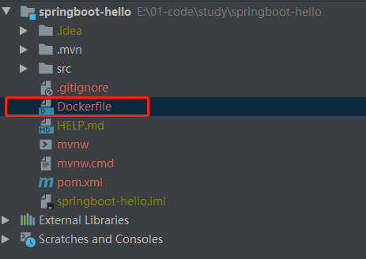
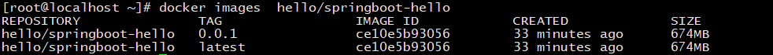

# Spring Boot Docker部署配置
## 1 配置docker远程连接端口
### 1.1 修改service文件
```shell script
vim /usr/lib/systemd/system/docker.service
```
### 1.2 找到 ExecStart，在最后面添加 -H tcp://0.0.0.0:2375，如下图所示  
  
### 1.3重启docker
```shell script
systemctl daemon-reload
systemctl restart docker
```
### 1.4 防火墙端口设置
```shell script
firewall-cmd --zone=public --add-port=2375/tcp --permanent
```

## 2 maven docker配置（两种方法实现部署）
### 2.1 方法一：maven配置结合Dockerfile
#### 2.1.1 pom 添加build plugin
```xml
<!-- docker的maven插件，官网 https://github.com/spotify/docker-maven-plugin -->
<plugin> 
  <groupId>com.spotify</groupId>  
  <artifactId>docker-maven-plugin</artifactId>  
  <version>1.2.0</version>  
  <executions> 
    <!-- 指定在install阶段执行 build-image 任务 -->
    <execution> 
      <id>build-image</id>  
      <phase>install</phase>  
      <goals> 
        <goal>build</goal> 
      </goals> 
    </execution> 
  </executions>  
  <configuration> 
    <!-- docker 远程连接地址 -->  
    <dockerHost>http://192.168.232.151:2375</dockerHost>  
    <!-- 镜像名称 -->  
    <imageName>hello/${project.artifactId}</imageName>  
    <!-- 镜像版本 -->  
    <imageTags> 
      <imageTag>${project.version}</imageTag> 
    </imageTags>  
    <!-- 允许覆盖docker images中的镜像 -->  
    <forceTags>true</forceTags>  
    <!-- Dockerfile文件的位置 -->  
    <dockerDirectory>${project.basedir}</dockerDirectory>  
    <!-- 打包的内容 -->  
    <resources> 
      <resource> 
        <targetPath>/</targetPath>  
        <directory>${project.build.directory}</directory>  
        <include>${project.build.finalName}.jar</include> 
      </resource> 
    </resources> 
  </configuration> 
</plugin>
```

#### 2.1.2 Dockerfile
* 位置：  

```dockerfile
FROM primetoninc/jdk:1.8
VOLUME /tmp
ADD target/springboot-hello-0.0.1.jar app.jar
ENTRYPOINT ["java","-jar","/app.jar"]
```

### 2.2 方法二：完全使用maven配置，免去编写Dockerfile文件
#### docker-maven-plugin 插件
```xml
<!-- docker 打包部署插件 -->
<!-- docker的maven插件，官网 https://github.com/spotify/docker-maven-plugin -->
<plugin> 
  <groupId>com.spotify</groupId>  
  <artifactId>docker-maven-plugin</artifactId>  
  <version>1.2.0</version>  
  <executions> 
    <!-- 指定在install阶段执行 build-image 任务 -->  
    <execution> 
      <id>build-image</id>  
      <phase>install</phase>  
      <goals> 
        <goal>build</goal> 
      </goals> 
    </execution> 
  </executions>  
  <!-- 远程操作docker信息配置，实现了免Dockerfile文件部署 -->  
  <configuration> 
    <!-- docker 远程连接地址 -->  
    <dockerHost>http://192.168.232.151:2375</dockerHost>  
    <!-- 镜像名称 -->  
    <imageName>hello/${project.artifactId}</imageName>  
    <!-- 镜像版本 -->  
    <imageTags> 
      <imageTag>${project.version}</imageTag> 
    </imageTags>  
    <!-- 允许覆盖docker images中的镜像 -->  
    <forceTags>true</forceTags>  
    <!-- 从基本镜像 java:8 的基础上构建-->  
    <baseImage>java:8</baseImage>  
    <!-- 镜像维护者的姓名和邮箱地址 -->  
    <maintainer><![CDATA[chen.nan<namchern@aliyun.com>]]></maintainer>  
    <!-- 容器数据卷，用于数据保存和持久化工作 -->  
    <volumes>/tmp</volumes>  
    <!-- 容器启动时运行的命令 -->  
    <entryPoint>["java", "-jar", "/${project.build.finalName}.jar"]</entryPoint>  
    <!-- 打包进入镜像的资源文件 -->  
    <resources> 
      <resource> 
        <targetPath>/</targetPath>  
        <directory>${project.build.directory}</directory>  
        <include>${project.build.finalName}.jar</include> 
      </resource> 
    </resources> 
  </configuration> 
</plugin>
```

## 3 发布到docker服务器
执行mvn命令
```shell script
mvn clean
mvn install
```
